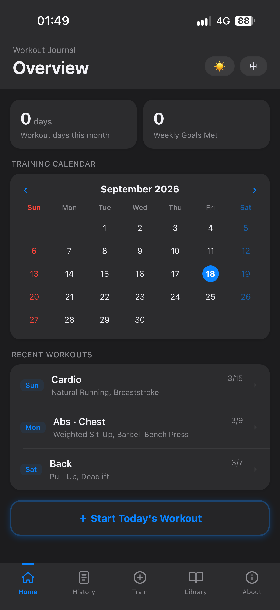
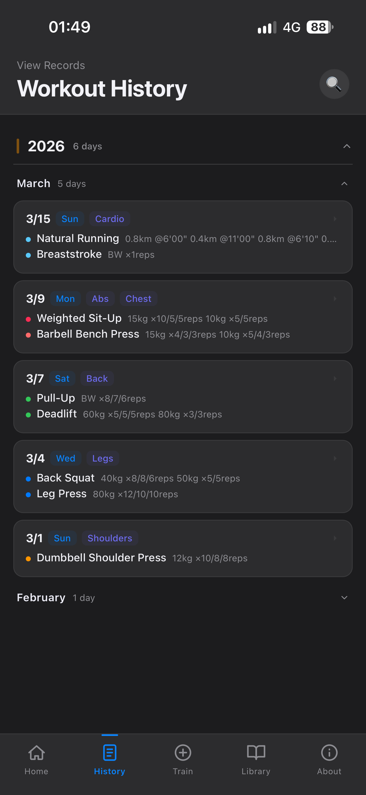
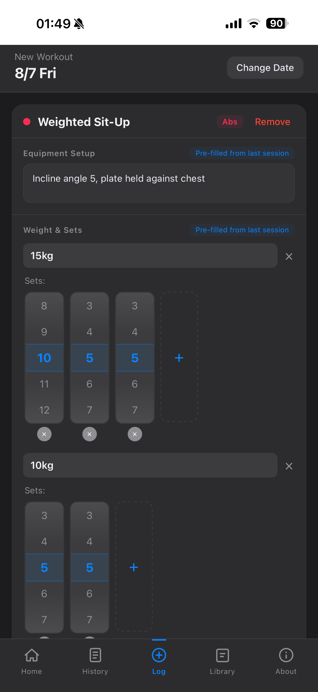

# 💪 GymReco 🤳

**A mobile-first PWA workout tracker / journal ｜ 手機優先的健身紀錄 App （漸進式網頁應用程式）**

> Log your workouts, build your exercise library, and track your progress — all stored locally on your device.
> 
> 輕鬆紀錄訓練、管理動作庫、追蹤進度。資料全部存在你的手機本地端。

---

## 🚀 Live Demo｜立即使用

Open with iPhone Safari or Android Chrome:

👉 **https://rubychenhaii.github.io/gymreco/**

Then: **Share → Add to Home Screen** for full-screen experience.

請以 iPhone Safari 或 Android Chrome 打開以下連結：

👉 **https://rubychenhaii.github.io/gymreco/**

接著：**分享 → 加入主畫面**，以全螢幕使用。原生App體驗！

---

## ✨ Features｜功能

### 📚 Workout Library｜訓練動作庫

- Log workouts with weight, sets, reps, and session notes.
  
  - 紀錄重量、組數、次數與當次訓練筆記。

- Personal exercise library with persistent exercise notes.
  
  - 建立自己的動作庫，並為每個動作保存永久筆記。

### 📅 Training Calendar｜訓練月曆

- Calendar overview with coloured dots for quick visual scanning.
  
  - 月曆以顏色點標示訓練類型，快速辨識本月訓練內容。

- Collapsible yearly and monthly history views.
  
  - 年度與月份皆可收合，讓長期紀錄保持整潔。

- Log workouts up to 10 days in the past.
  
  - 支援補登 10 天內的訓練紀錄。

### 🤖 AI-ready Workout Export｜爲 AI 分析設計的匯出功能

- Copy Daily workout (TXT) to clipboard in one tap.
  
  - 將單日運動紀錄一鍵複製到剪貼簿。

- Export long-term workout logs as AI-ready Markdown.
  
  - 將長期運動紀錄匯出為適合 AI 分析的結構化 Markdown。

- Paste your logs to ChatGPT, Gemini, or any LLM of your choice.
  
  - 貼到 ChatGPT、Gemini 或任何你喜歡的 AI 服務。

- Get personalized analysis, recovery suggestions, and long-term training insights!
  
  - 獲得個人化訓練分析、恢復建議、以及長期訓練趨勢洞察！

### 🍉 Hassle-Free Experience｜輕鬆使用

- Bilingual interface (中文 / English) + Night Mode.
  
  - 內建中英文介面與深色模式。

- Install as a PWA, works offline, and updates automatically.
  
  - 可安裝至桌面，支援離線使用並自動更新。

### 🔒 Data & Privacy｜資料與隱私

- All data stays in your browser via localStorage — no account required.
  
  - 所有資料皆儲存在瀏覽器 localStorage，不需登入帳號。

- Export / Import JSON for seamless, offline data backup.
  
  - 存檔 / 讀檔：支援 JSON 匯出及匯入功能。

- Restore sample data or start with a clean library anytime.
  
  - 可隨時恢復範例資料，或一鍵清空，從自己的訓練開始。

---

## 📸 Screenshots

   

---

## 🧩 Usage｜使用情境

### AI-assisted Training Workflow｜AI 輔助訓練流程

🏋️ Record your workout：**記錄訓練**

↓

📋  Copy today's workout in daily workout tab / Export workout logs in About page：**一鍵複製今日訓練 / 在「關於」頁面匯出訓練紀錄**

> 在每日訓練卡片中，可將每日訓練內容一鍵複製到剪貼簿 / 或將所有訓練紀錄一次匯出為 Markdown 檔案（位於「關於」頁面）！

↓

🤖 Paste into ChatGPT, Claude, Gemini, or any LLM：**貼給你喜愛的 AI LLM**

↓

📈 Receive personalized analysis, recovery advice, and long-term insights：**獲得訓練分析、恢復建議與長期進度洞察**

> 複製每日訓練內容，追蹤短期進度；匯出 Markdown 檔案，適合長期分析。

↓

🏋️ Keep training：**繼續運動！**

---

### Backups｜簡單備份

GymReco 提供「**輸出為JSON**」功能（位於「關於」頁面），輸出一個輕量檔案進行存檔/讀檔。

JSON export and import features are available in the About page. Handy for backing up or restoring your data!

---

### Sample Data｜範例資料 - 讓你瞭解 GymReco 的運作！

App 中預設顯示之紀錄為範例資料。目的為展示資料型態，讓初次使用者瞭解 GymReco 的運作模式。

GymReco 提供「**清除 GymReco**」功能（位於「關於」頁面），一鍵將範例資料全數刪除。讓嶄新的 GymReco 陪你開始健身旅程。

The workout records shown by default are sample data.

Ready to make GymReco yours? Start Fresh (available in the About Page), remove the sample data, and start from day one!

---

### Data Safety｜安全儲存你的資料

自設計之初，GymReco 刻意不使用任何雲端同步、帳號和API呼叫。

因此，請注意以下情況可能導致資料永久消失：

- 在瀏覽器設定中清除「網站資料」或「localStorage」
- 換手機或換瀏覽器（資料不會自動轉移）
- 重灌手機作業系統

All workout data stays inside your browser using localStorage.

Data will be permanently lost if you clear site data, switch devices, or reinstall your OS.

---

## 🛠️ Local Development｜本機開發

```bash
git clone https://github.com/rubychenhaii/gymreco.git
cd gymreco
npm install
npm start
```

To deploy:

```bash
npm run deploy
```

---

## 📦 Tech Stack｜技術

- React 19
- PWA + Service Worker - offline support
- localStorage - no backend required
- No third-party UI libraries
- Deployed via GitHub Pages
- Developed with help from Claude Sonnet 4.6

---

## ⛓️ Architecture｜架構

> Current architecture since v1.8.0.
> 
> 目前架構自 v1.8.0 起使用。


---

## 🎯 Product Philosophy

GymReco is built around one simple goal:

> **Create a workout tracker that I genuinely enjoy using every day.**

Every feature in GymReco exists because it solves a real problem encountered during my own training.

Some examples:

- 📴 **Local-first.** No accounts, no cloud sync, and no external APIs.
- ⚡ **Lightweight by design.** Small bundle size, fast startup, and offline support through PWA.
- 📅 **Simple over complex.** History stays structured without unnecessary nesting or configuration.
- ⏪ **10-day Back-log.** Enough flexibility to catch up, while encouraging timely workout logging.
- 🎨 **Meaningful calendar.** Calendar dots represent workout categories rather than every individual exercise.
- 📈 **Record first, analyze later.** Advanced analytics intentionally belong in a future companion app (GymStats), keeping GymReco focused and lightweight.

As the saying goes:

> **If it ain't broke, don't fix it.**

GymReco evolves only when real-world use reveals a genuine need.

---

### 🤖 Development

GymReco was built through AI-assisted iterative development using Claude as a collaborative programming partner.

Instead of writing code directly, I focused on product design, workflow planning, UX refinement, testing, debugging, and iterative decision-making.

Today, GymReco continues to evolve through daily real-world use rather than feature chasing.

---

## 📋 Changelog｜版本紀錄

**v1.9.5**

- Added monthly / yearly Markdown exports to About page

- Added Year category in History page

**v1.9.2**

- Added **Copy Today's Workout (TXT)** to clipboard for one-tap sharing

- Added **AI-ready workout export** in a structured Markdown format for long-term AI-assisted training analysis

- Top left corner of the Home Page now shows "workout days this month" instead of "workouts this week"

**v1.9.1**

- Calendar dots now deduplicated by colour (one dot per colour per day), preserving workout order

- Exercise library now shows a hint explaining the calendar dot behaviour

- Added "Stretching" as a new muscle group category in the exercise library

- Maintenance tools in About page: Reset to sample data / Start Fresh (clear all data)

**v1.9.0**

- Full codebase refactor: from a single 1,700-line file into 15 modular component files

- Service Worker updated to network-first strategy for automatic silent updates

- Strengthened JSON import validation

- Full i18n audit: all UI strings now go through the translation system

- Monthly grouping with collapsible sections in History tab

- Inline session editing in Detail view

- Back-log: log workouts up to 10 days in the past, with a custom date picker

**v1.6.0**

- JSON/CSV export and JSON import (About page)

**v1.0–1.5**

- Initial build, feature expansion, PWA deployment, security hardening

---

## 👤 Author｜作者

**Ruby Chen**
GitHub: [@rubychenhaii](https://github.com/rubychenhaii)

---

## 📄 License

MIT © 2026 Ruby Chen
